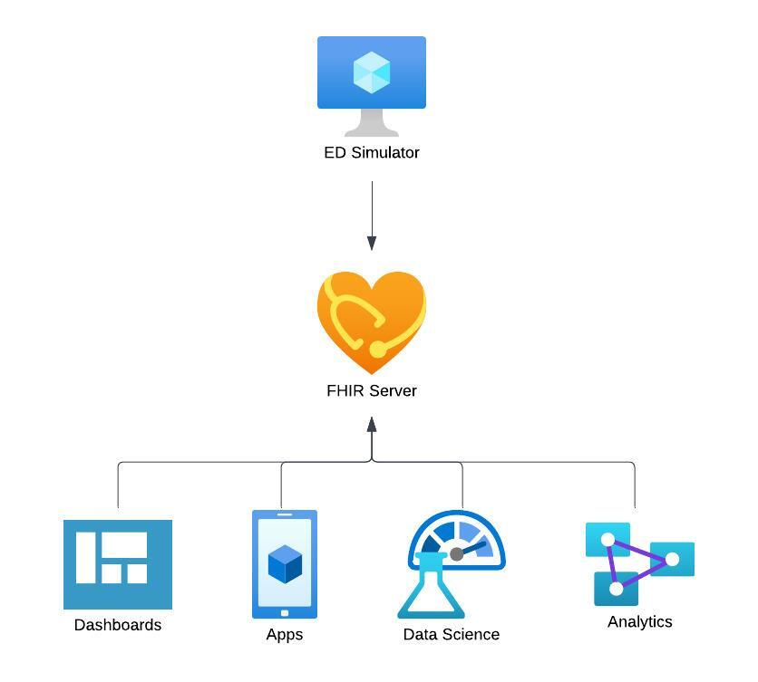
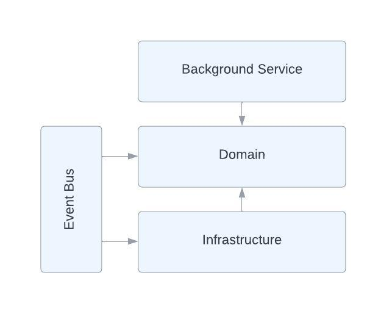
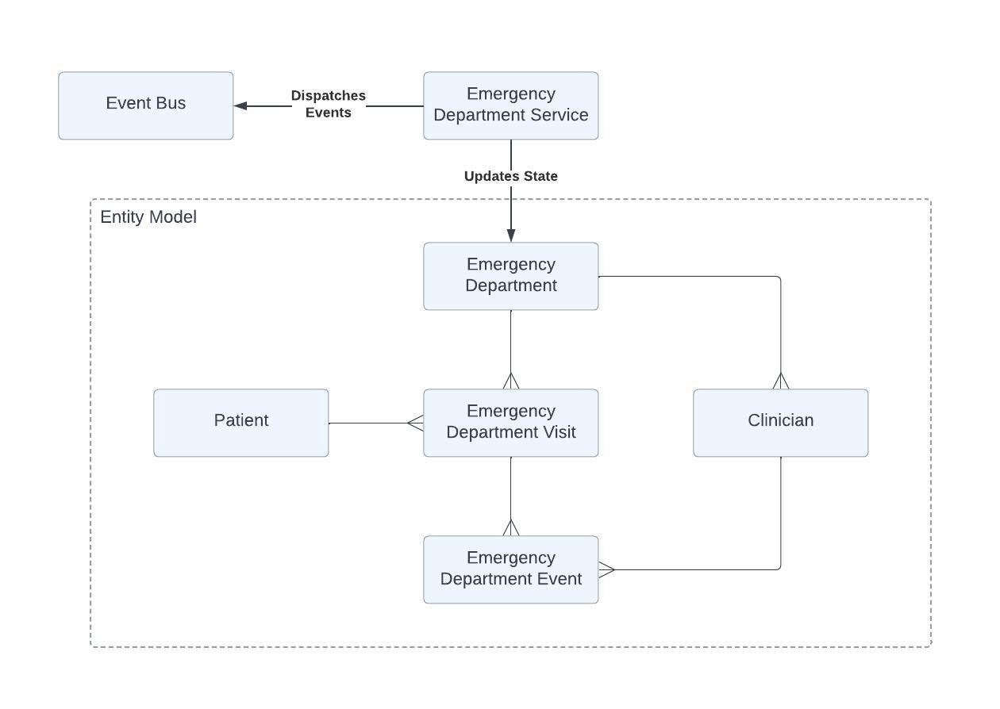

# Design

## High Level Solution

The software will execute as a service on the target host and send messages to the FHIR
server in order to reflect the state of the emergency department.

Different types of tools and applications will connect to the FHIR server to extract data 
for various purposes.

## Application Architecture

The architecture of the solution is based on Domain Driven Design.

An event bus will be implemented to allow domain events to be handled by 
infrastructure services.

## Domain Model

The domain model consists of an relational entity model, which is orchestrated by a domain
service. The domain service is responsible for dispatching events to the event bus.

